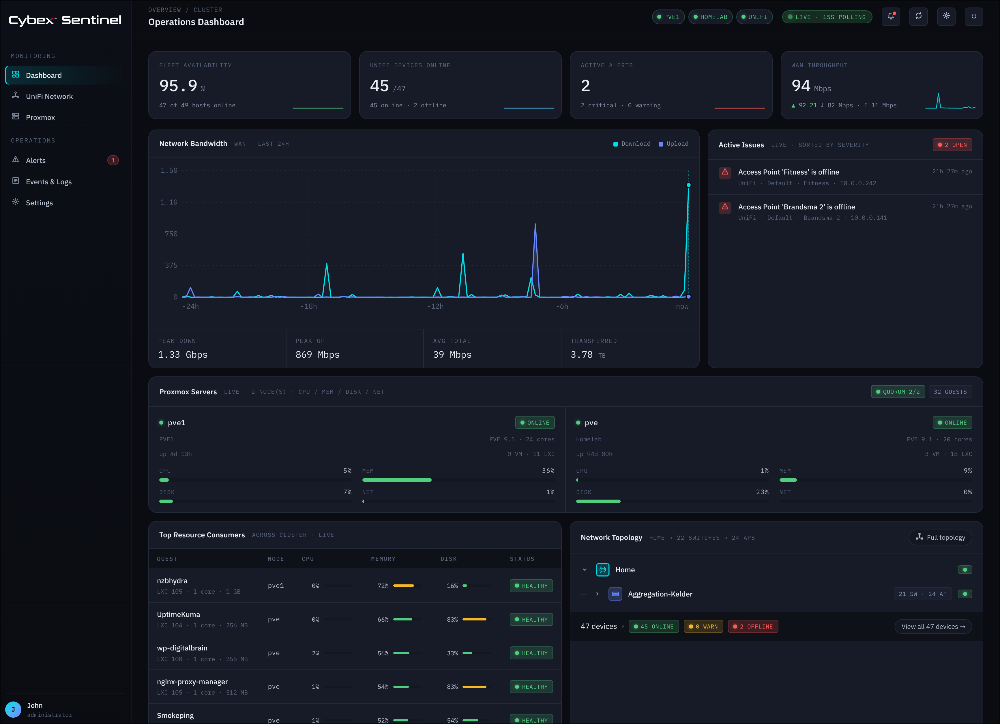

# Cybex Sentinel

> A dark, broody, real-time dashboard that watches your **UniFi network**,
> **Proxmox VE** cluster and **Unraid** servers so you don't have to keep five browser tabs open like
> some kind of animal.



## 🚧 Heads up — this is a work in progress

Sentinel works, looks nice, and shows real numbers — but corners have been cut,
edges remain sharp, and some buttons exist mostly out of optimism. Expect bugs,
expect rough patches, expect occasional "huh, that's new" moments. Pull requests
and side-eyes both welcome.

## What is this thing?

Sentinel is the panel a NOC operator would build for themselves at 1am after
losing one too many fights with the UniFi mobile app. It polls your gear over
their official APIs every 15 seconds, smooshes the data into one coherent
picture, and renders it on a single page that does not require you to click
seven menus to find out a switch is on fire.

In particular, it tells you:

- **Is everything up?** — fleet availability, devices online, an actual count of
  "things currently angry at me."
- **Is the WAN being weird?** — a 24h bandwidth chart that fills in as the
  backend runs, so you can finally answer the "was the internet slow yesterday?"
  question with something other than a shrug.
- **Which VM is eating all the RAM?** — per-guest CPU/MEM/DISK across every
  Proxmox node, sorted by guilt.
- **Where is that one access point hiding?** — a reconstructed network topology
  tree built from uplink relationships, because apparently nobody else thought
  this was worth drawing.
- **What just happened?** — a live event stream stitched together from Proxmox
  task history and UniFi device events.
- **Should I be doing something about this?** — threshold-derived alerts with an
  acknowledge / resolve workflow, so the red dot in the corner means something.
- **Can it reach me somewhere else?** — warning and critical alerts can be sent
  through SMTP email, Slack incoming webhooks and Telegram bot messages.

No mock data anywhere. If a number is on screen, something somewhere actually
said that number out loud over HTTP.

## The stack, briefly

- **Backend** — Rust (axum + tokio + reqwest + lettre). One process. Polls
  everything, serves the API, serves the frontend, holds your beer.
- **Frontend** — React + TypeScript, built with Vite, packaged with Bun. Dark
  theme by default because we have eyes.
- **Storage** — PostgreSQL + TimescaleDB. All settings, all credentials and the
  metric history live here. There is no config file. There is no second config
  file hiding behind the first one. Just the database.

```
┌─────────────┐   poll 15s    ┌──────────────────┐   HTTP/SSE    ┌──────────────┐
│ Proxmox VE  │ ◀──────────── │  Rust backend    │ ◀──────────── │  React SPA   │
│ UniFi Net.  │ ◀──────────── │  (axum poller)   │ ──────────────▶  (Bun build) │
│ Unraid API  │ ◀──────────── │                  │               │              │
└─────────────┘               └──────────────────┘   /api/stream └──────────────┘
```

## Pages

| Page | What it shows |
|------|---------------|
| **Dashboard** | The "everything is fine (citation needed)" page — availability, alerts, live WAN throughput, 24h bandwidth, per-node Proxmox tiles, top resource consumers and a topology snapshot. |
| **UniFi Network** | Every adopted device with live clients, throughput, uptime, and a per-device detail panel — port grids for switches, radios for APs. |
| **Network Scanner** | Fast Nmap-backed subnet discovery, MAC/vendor inventory and optional port/service scans. |
| **Proxmox** | Every node with live CPU/MEM/DISK/NET, and every VM / LXC guest grouped under its node with utilization bars. |
| **Unraid** | Array and pool health, disks, Docker containers, VMs, parity status and warning/alert notifications from the Unraid GraphQL API. |
| **Alerts** | Whatever crossed a threshold, with acknowledge / resolve so future-you stops seeing the same red dot. |
| **Events & Logs** | A unified, time-ordered "what happened" stream. |

## Running it

The fast path. You need [Docker](https://docs.docker.com/get-docker/) with
Compose. That's it.

```bash
docker compose up -d --build
```

Then open <http://localhost:8787>, finish the first-user setup, and manage your
Unraid, UniFi and Proxmox source(s) on the **Settings** page. The backend will
start polling immediately and the dashboard will start filling in.

The `app` image is a multi-stage build that compiles the Rust backend, builds
the Vite/React bundle with Bun, and ships a slim runtime image that serves both
on port 8787. The TimescaleDB volume persists across rebuilds, so your data
sticks around.

The `scanner` service uses the same image in `network-scanner-worker` mode with
host networking and `NET_RAW` / `NET_ADMIN` capabilities. That keeps the web app
container unprivileged while still letting Nmap perform fast ARP discovery on
the LAN.

```bash
docker compose logs -f app    # tail logs
docker compose down           # stop, keep data
docker compose down -v        # stop, also nuke the database volume
```

### Local (non-Docker) run

If you prefer building on the host with only the database in a container,
`./run.sh` does the whole dance. Or step by step:

```bash
docker compose up -d db                          # just the database
cd frontend && bun install && bun run build      # build the SPA
cd ../backend && cargo run --release             # backend serves API + SPA on :8787
```

For hot-reload during development, run the Vite dev server separately:

```bash
docker compose up -d db
cd backend && cargo run                          # API on :8787
cd frontend && bun run dev                       # UI on :5173, proxies /api → :8787
```

## Configuration

There is no config file. Everything — sources, API credentials, polling
intervals, alert thresholds, notification channels, UI preferences — lives in
the database and is edited from the in-app **Settings** page. Changes take
effect on the next poll cycle, no restart needed.

The database address and secret-encryption key are the exceptions, because the
backend needs both before it can read database-backed settings. `DATABASE_URL`
points at PostgreSQL. `SENTINEL_SECRET_KEY` is strongly recommended for stable
credential encryption; use a long random value or URL-safe 32-byte base64 key.
If it is absent, Sentinel falls back to a local deterministic key and logs a
warning.

Self-signed certs on your Unraid/UniFi/Proxmox hosts are accepted automatically,
because that is the reality of homelab gear.

## Notifications

Sentinel sends outbound notifications when an alert newly opens or when a
cleared alert fires again. It does not send the same still-active alert on every
poll. Configure channels under **Settings -> Notifications** and use the test
button for each channel before relying on it.

Supported channels:

- **Email** — SMTP host, port, STARTTLS, implicit TLS or plain SMTP, optional
  username and password, sender address and one or more recipients.
- **Slack** — an incoming webhook URL from your Slack app.
- **Telegram** — a bot token plus the chat ID that should receive messages.

Telegram setup:

1. In Telegram, start a chat with `@BotFather`.
2. Send `/newbot`, choose a name and username, then copy the bot token.
3. Start a direct chat with the new bot, or add it to the target group.
4. Send a message to that chat.
5. Open `https://api.telegram.org/bot<token>/getUpdates` in a browser, replacing
   `<token>` with the token from BotFather.
6. Find `message.chat.id` in the JSON response. Group and supergroup IDs are
   usually negative numbers; supergroups commonly start with `-100`.
7. Enter the bot token and chat ID in **Settings -> Notifications -> Telegram**,
   save, then press **Test Telegram**.

Notification secrets are encrypted before storage and masked in the API
response after saving. Treat `SENTINEL_SECRET_KEY` the same way you treat source
API keys.

## Data sources

- **Proxmox VE** — `/api2/json/cluster/resources`, `/nodes/{n}/rrddata`,
  `/nodes/{n}/tasks`, with an API token (any role with `PVEAuditor` on `/` is
  enough).
- **UniFi Network** — the local Integration API
  (`/proxy/network/integration/v1`, requires UniFi Network 9.0+), with an API
  key created under Settings → Control Plane → Integrations. Topology is
  reconstructed from each device's uplink.
- **Unraid** — the local GraphQL API at `/graphql`, authenticated with the
  `x-api-key` header. Sentinel polls server identity, OS/API versions, array
  capacity, parity status, disks, Docker containers, VMs, notifications and
  CPU/memory/temperature metrics.

## Auth & security notes

- Single administrator account. Created on first launch; the setup endpoint
  disables itself once a user exists.
- Passwords are hashed with Argon2id. Session tokens are 32 random bytes; only
  the SHA-256 of a token is stored in the database, so a backup leak doesn't
  hand out replayable sessions.
- The session cookie is `HttpOnly` and `SameSite=Lax`. It is **not** `Secure`
  by default (so plain-HTTP LAN deployments still work). If you put Sentinel
  behind TLS, set `SENTINEL_SECURE_COOKIES=1` on the backend.
- Unraid/UniFi/Proxmox credentials and notification secrets are encrypted at
  rest before they are written to PostgreSQL. Set `SENTINEL_SECRET_KEY` before
  relying on this for backups or cross-host restores; without it, the fallback
  key is intended only for local convenience.

## Layout

```
backend/    Rust monitoring backend (axum)
  migrations/  PostgreSQL + TimescaleDB schema
  src/
    proxmox.rs   Proxmox VE API client
    unraid.rs    Unraid GraphQL API client
    unifi.rs     UniFi Integration API client
    db.rs        PostgreSQL / TimescaleDB data access
    config.rs    RuntimeConfig, loaded from the database
    engine.rs    Poller, aggregation, alert/event derivation
    history.rs   In-memory metric working set
    auth.rs      Argon2 + session cookies
    notify.rs    Email, Slack and Telegram alert delivery
    importer.rs  One-time legacy config.toml import
    model.rs     JSON contract served to the frontend
    routes.rs    HTTP surface
frontend/   React + TypeScript SPA (Vite + Bun)
  src/
    pages/       Dashboard, UniFi, Proxmox, Unraid, Alerts, Events, Settings
    components.tsx, topology.tsx, api.ts
Dockerfile           Multi-stage build: frontend (Bun) + backend (Rust) → slim runtime
docker-compose.yml   TimescaleDB + app
```

## Roadmap (a.k.a. things that are also WIP)

Roughly, in vague order of "things that bug me most when I open it":

- More alert rule types beyond static thresholds
- Per-source health diagnostics that are actually helpful when a source goes red
- More than one user account, maybe with read-only viewers
- Retention controls in the UI for the metric history
- Whatever else turns out to be obviously missing the next time something
  breaks at 1am

If you find a sharp edge, please file an issue — preferably with a small
description of what you were doing when the dashboard betrayed you.
